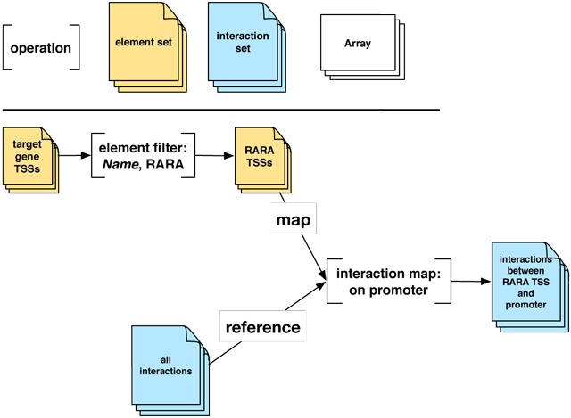

.. _example_tfbs_subset:

Target gene-to-TFBS subproblem
==============================

In the process of building a framework to run the *targetscope* application, we want to build a smaller problem that can be used to start creating a web service that will accept requests, process dependencies and push responses.

We start with the larger problem described in the :ref:`target gene-to-TFBS <example_tfbs>` document:

**Inputs**
        1. :ref:`Set <compound_set>` of target gene :ref:`transcription start sites <compound_element>` (TSSs)
        2. :ref:`Set <compound_set>` of all correlated :ref:`interactions <compound_interaction>` (pairings of promoter :ref:`regions <compound_element>` and distal element regions)

**Outputs**
        1. :ref:`Set <compound_set>` of target gene TSSs, filtered on the :ref:`gene name <base_name>` RARA ("RARA TSSs")
        2. :ref:`Set <compound_set>` of all correlated :ref:`interactions <compound_interaction>` that are filtered on the set of RARA TSSs

**Operations**
        1. :ref:`Filter operation <ops_filter>` that creates "RARA TSSs" set
        2. :ref:`Map operation <ops_map>` that finds all RARA TSSs that overlap interaction promoter regions

